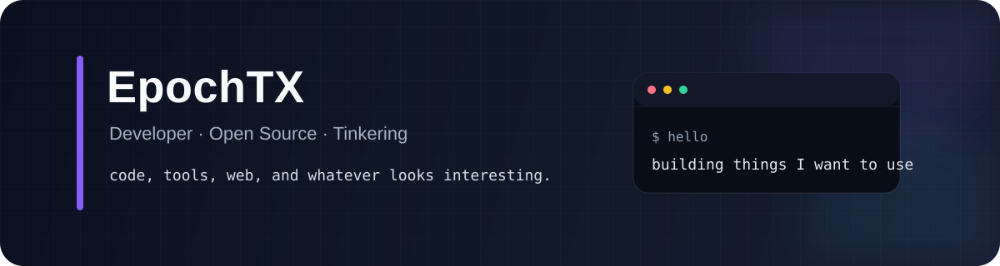

  

  
  
  

  Build · Learn · Ship · Iterate

---

## 👋 About Me

你好，我是 **EpochTX**，喜欢把想法做成真正可用、可维护、可以持续迭代的项目。

- 🤖 关注 **AI Agent / Developer Tooling / CLI / Open Source**
- ⚙️ 主要使用 **TypeScript、Node.js、pnpm**，也在持续使用和学习 **React、Vue、Python**
- 🧩 对 **开发者体验、自动化、工程质量、UI 与可视化** 很感兴趣
- 🌱 喜欢边学习边实践，把过程沉淀为可以复用的工具和开源项目

---

## 🚀 Featured Project

### [SkillBench](https://github.com/EpochTX/skillbench)

**The open benchmark, linter and compatibility checker for AI Agent Skills.**

面向 AI Agent Skills、`AGENTS.md`、`CLAUDE.md`、Cursor Rules 等配置文件的开源基准、静态检查与跨 Agent 兼容性工具。

  
  
  
  

`Lint` · `Security` · `Token Efficiency` · `Compatibility` · `Benchmark` · `SARIF` · `GitHub Actions`

---

## 🧰 Tech Stack

### Main

### Also exploring

---

## 🎯 Current Focus

- 持续完善 **SkillBench** 的规则、Benchmark、兼容性分析与 CI 体验
- 做更可靠、更清晰的 **AI Agent 开发工具**
- 提升项目的测试、文档、发布流程与长期可维护性
- 保持学习，持续发布真正能被别人使用的作品

---

  Code is not only a tool — it is also a way to turn ideas into things that work.

