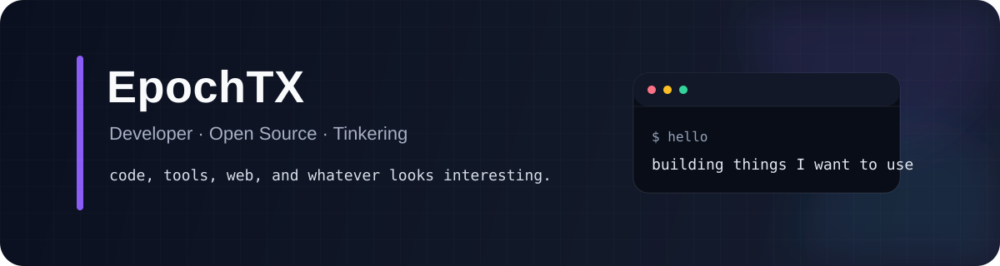

  

## Hi, I'm EpochTX 👋

主要用 **TypeScript / JavaScript / Node.js**，也会用 **React、Python**。这里整理我的开源工具、网页实验和研究笔记。

[个人网站](https://epochtxhub.com) · [Bilibili](https://space.bilibili.com/475622047) · [X / Twitter](https://twitter.com/choukingsum) · [Email](mailto:admin@epochtxhub.com)

### 工具与实验

| 项目 | 内容 |
| --- | --- |
| [SkillBench](https://github.com/EpochTX/skillbench) | AI Agent 指令与 Skills 的静态检查、安全分析和兼容性评估 |
| [Internet Chaos Simulator](https://github.com/EpochTX/Internet-Chaos-Simulator) | 用 Service Worker 模拟延迟、限速和请求失败的浏览器实验室 |
| [Step Keeper](https://github.com/EpochTX/Step-keeper) | 面向个人 Zepp Life 账号的步数控制台 |
| [OpenAIsm](https://github.com/EpochTX/OpenAIsm) | 对比 ChatGPT 请求与响应中模型标记的用户脚本 |

### 网站与笔记

| 项目 | 内容 |
| --- | --- |
| [my-site](https://github.com/EpochTX/my-site) | 个人主页、项目目录、生活相册与网页工具 |
| [Consumption Upgrade Study](https://github.com/EpochTX/Consumption-Upgrade-Study) | 居民消费结构升级的研究说明 |
| [X-UI](https://github.com/EpochTX/X-UI) | X-UI 搭建笔记与配置文件 |

使用与开发说明见各项目 README。

  

